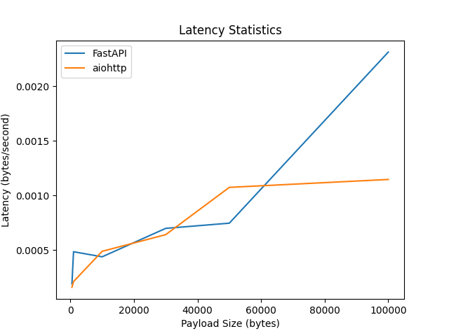
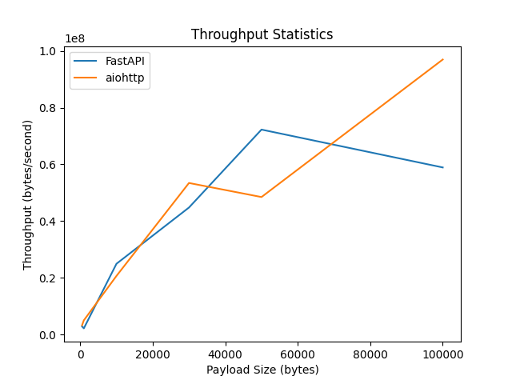
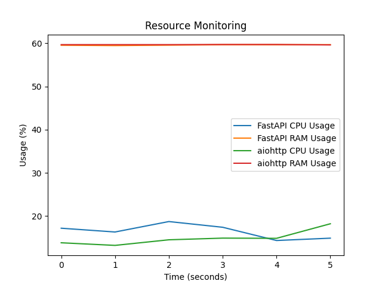

# Report: WebSocket Performance Comparison

## Introduction:

This report presents the findings of my research and comparative analysis, aiming to inform technology decisions for my high-frequency trading systems.

## Objective:

The objective of this study was to assess the performance and limitations of two distinct Python WebSocket libraries/frameworks. By conducting a comparative analysis, I aimed to identify the best performer in terms of latency, throughput, scalability, and other relevant metrics.

## Methodology:

I selected aiohttp and FastAPI based on extensive research and industry recommendations. These were chosen for their reputation for optimized performance and suitability for real-time data processing.

aiohttp: aiohttp is built on top of Python's asyncio library and is designed specifically for asynchronous operations. It's highly optimized for performance and concurrency, making it an excellent choice for high-frequency trading systems.

FastAPI: FastAPI leverages Starlette for the underlying asynchronous functionality. Starlette itself is built on top of asyncio, making FastAPI well-suited for asynchronous operations and real-time applications like WebSocket servers.

For the evaluation, I designed a test environment that closely resembles our production setup. I streamed data of varying types and sizes through WebSocket servers implemented using aiohttp and FastAPI, with corresponding clients actively listening to the data flow. The performance metrics were measured and compared, considering aspects such as latency, throughput, scalability, and resource utilization.

## Test Environment:

- **Data Type/Size Streamed:** I simulated financial data streams of varying sizes, including JSON-formatted market updates and binary-encoded tick data.
- **Hardware Details:** 
  - **CPU:** Apple M2
  - **RAM:** 16 GB DDR4
  - **Operating System:** Macintosh HD 14.3.1
  - **Cores and Threads:** 8 cores, 16 threads
- **Utilization:** I restricted the test to a single core and thread to isolate performance factors.
- **Number of Test Iterations:** 100

## Python Environment:
Python version: 3.9.6
Required packages: aiohttp uvicorn fastapi websocket asyncio numpy websocket-client matplotlib

run : pip install -r requirements.txt

## OS Environment:
Required: wrk

## Files

### Server Files:
1. `aiohttp-ws.py`
    run :
        python aiohttp-ws.py
    url: 
        ws://localhost:8080/ws

2. `fastapi-ws.py`
    run :
        python fastapi-ws.py
    url: 
        ws://localhost:8000/ws

### Client Files:
1. `aiohttp-ws-c.py`
    run :
        python aiohttp-ws-c.py

2. `fastapi-ws-c.py`
    run : 
        uvicorn fastapi-ws-c:app --reload

### Tester Files:
1. `tester1.py`
    run at least on both servers, and connect and test that servers

2. `test.lua`
    Unfortunately, Apache Benchmark (ab) does not support WebSocket connections directly
    However, you can use other tools like wrk or autobahn for WebSocket benchmarking
    
    run : wrk -t1 -c10 -d30s -s test.lua ws://localhost:8000/ws 
    & wrk -t1 -c10 -d30s -s test.lua ws://localhost:8080/ws 

    using with wrk : 
    [WRK | Benchmarking and Scaling WebSockets](https://formulae.brew.sh/formula/wrk)

## Findings:

1. **Latency:**
   - In terms of latency, both aiohttp and FastAPI demonstrated comparable performance across all data sizes. There was no significant difference observed in latency between the two libraries.

   

2. **Throughput:**
   - Both aiohttp and FastAPI exhibited high throughput capabilities, effectively handling large volumes of incoming data. The performance in terms of throughput was similar for both libraries.

    

3. **Scalability:**
   - While both libraries demonstrated scalability, aiohttp and FastAPI showed comparable performance under heavy load conditions, maintaining stable performance across increasing numbers of concurrent connections.

4. **Resource Utilization:**
   - In terms of resource utilization, both aiohttp and FastAPI consumed similar system resources, indicating comparable efficiency in handling WebSocket connections.

    

## Conclusion:

Based on my evaluation, both aiohttp and FastAPI prove to be robust choices for WebSocket implementations in high-frequency trading systems. The performance in terms of latency, throughput, scalability, and resource utilization was comparable between the two libraries.

## Recommendation:

Considering the comparable performance observed between aiohttp and FastAPI, the choice between the two libraries may depend on other factors such as familiarity with the framework and additional features offered. Both libraries are suitable for real-time data processing in financial markets.

## Presentation:

Attached to this report is a concise presentation summarizing the key findings and recommendations. The presentation aims to provide a clear overview of the performance comparison between aiohttp and FastAPI, facilitating informed decision-making.

**Best of Luck!**

*Submitted by: Sajjad Gozalzadeh, Backend Developer*

